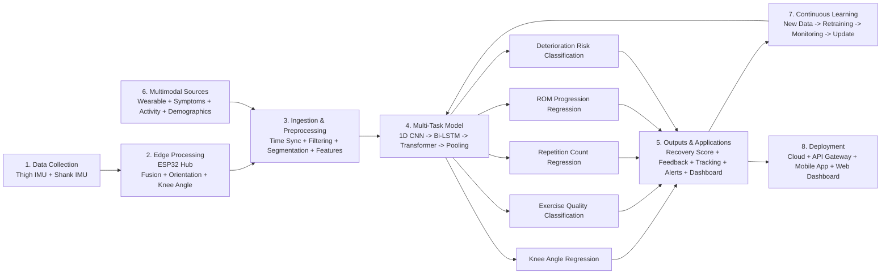

# RecoverAI Joint - GCL 2026 Codebase

This repository contains a complete implementation of the RecoverAI Joint demo described in:

- RecoverAI_Joint_GCL2026.pptx.pdf
- https://recoverai-joint-demo.swapnilsrivastava199.chatgpt.site/
- https://recoverai-joint-demo.swapnilsrivastava199.chatgpt.site/application

It includes:

- Marketing/vision landing page
- Patient application experience
- Care-team dashboard mode
- Mock API for recovery signals, exercises, check-ins, and devices
- Deployable ML microservice matching the architecture diagram
- Shared schema layer aligned to the architecture

## ML Architecture (Main View)


Exact architecture image used in the deck and demo.



Implementation reference:

- Model definition: apps/ml/app/model.py
- Preprocessing pipeline: apps/ml/app/pipeline.py
- Inference API: apps/ml/app/main.py
- App integration endpoint: apps/api/src/server.ts

## Architecture

The implemented architecture follows the deck's system narrative:

1. Two wearable IMUs on leg segments (thigh + shank)
2. Sensor stream to an ESP32 hub
3. Shared data schema used by both patient and clinician experiences
4. Explainable trajectory model and clear, non-black-box outputs
5. Deployed ML inference service for multi-task outputs

ML architecture coverage implemented:

1. Data collection: thigh and shank IMU streams
2. Edge processing context: ESP32 hub abstraction
3. Data ingestion and preprocessing: sync, filtering, segmentation, feature engineering
4. Multi-task deep learning model: 1D CNN + Bi-LSTM + Transformer encoder + multi-head outputs
5. Outputs and applications: recovery score, exercise feedback, progress tracking, risk alert class, clinician dashboard signals
6. Multimodal data context: wearable + symptoms + activity + demographics
7. Continuous learning representation: data collection -> retraining -> monitoring -> model update pipeline steps
8. Deployment: ML service + API + web via Docker Compose

Core equation included in the model context:

theta_knee = theta_shank - theta_thigh - theta_cal

## Project Structure

```
.
├── apps
│   ├── api
│   │   └── src
│   │       ├── mockData.ts
│   │       └── server.ts
│   ├── ml
│   │   ├── app
│   │   │   ├── main.py
│   │   │   ├── model.py
│   │   │   ├── pipeline.py
│   │   │   └── schemas.py
│   │   ├── Dockerfile
│   │   ├── README.md
│   │   └── requirements.txt
│   └── web
│       ├── index.html
│       └── src
│           ├── App.tsx
│           ├── lib/api.ts
│           ├── main.tsx
│           ├── pages/ApplicationPage.tsx
│           ├── pages/LandingPage.tsx
│           └── styles.css
├── packages
│   └── shared
│       └── src/index.ts
├── docker-compose.yml
└── README.md
```

## Pages and Routes

- `/`:
	- Hero and product story
	- Anchors: `#how-it-works`, `#system`, `#opportunity`
	- CTA: Launch application
- `/application`:
	- Patient view tabs: Today, Exercise, Check-in, Progress
	- Role switch: Patient application / Care-team dashboard

## API Endpoints

Base URL: `http://localhost:8787/api`

- `GET /health`
- `GET /patient`
- `GET /tasks/today`
- `POST /exercise/complete`
- `GET /checkin`
- `POST /checkin`
- `GET /progress`
- `GET /devices`
- `GET /care-team`
- `POST /ml/infer`

### ML Service Endpoints

Base URL: `http://localhost:8000`

- `GET /health`
- `POST /infer`

## Run Locally

### 1) Install dependencies

```bash
npm install
```

### 2) Run API and web app

Use separate terminals:

```bash
npm run dev:api
```

```bash
npm run dev:web
```

Then open:

- Web app: http://localhost:5173
- API: http://localhost:8787/api/health

### 3) Run ML architecture service

```bash
python3 -m venv .venv
source .venv/bin/activate
pip install -r apps/ml/requirements.txt
npm run dev:ml
```

ML health:

- http://localhost:8000/health

### 4) Deploy complete stack with Docker

```bash
npm run deploy:up
```

Stop:

```bash
npm run deploy:down
```

## Notes on Scope

This implementation is a prototype simulation, consistent with the presentation framing.
It is not a medical device and does not provide diagnosis or treatment instructions.

